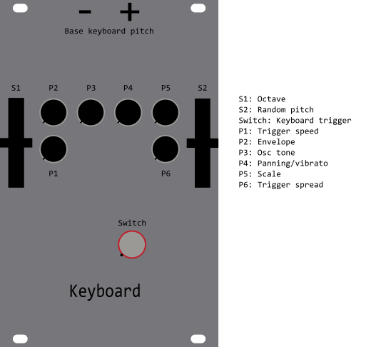

# Chord Buffer

Chord arppegio with a basic FM synth inspired by analog shift register. Built with Synthux Academys Simple Touch but can be used standalone with a Daisy Seed and midi.

Video:

Chord Buffer stores the last 8 notes played and triggers them as a chord with touch, midi or the built-in sequencer. Notes can be spread out when using the sequencer to create a arppegio. The scale selector will quantize all notes to the selected scale and the random pitch slider will randomize the pitch based on probability (0-100%).

## Requirements

- Daisy Seed
- MPR121 (optional if you want to use the touch interface)

preferable use the [Synthux Academy Simple Touch](https://synthuxacademy.com/product/simple-touch/) which has all the components needed.

## Controls

## Installation

1. Download the .bin file from the [release page](https://github.com/filipforsstrom/chord-buffer/releases)
2. Use the [Daisy Web Programmer](https://electro-smith.github.io/Programmer/) to flash your Daisy Seed

## Build from source

1. Follow Electro Smiths guide on how to [setup your development environment](https://github.com/electro-smith/DaisyWiki/wiki/1.-Setting-Up-Your-Development-Environment)
2. Clone this repo
3. Update the `Makefile` with the path to your DaisyExamples folder
4. Run task `build_and_program_dfu` to build and upload to your Daisy Seed
